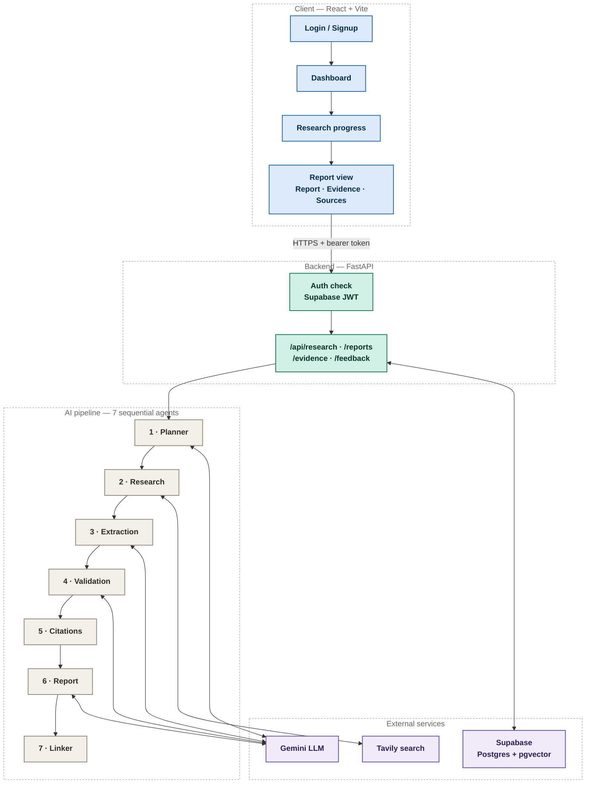
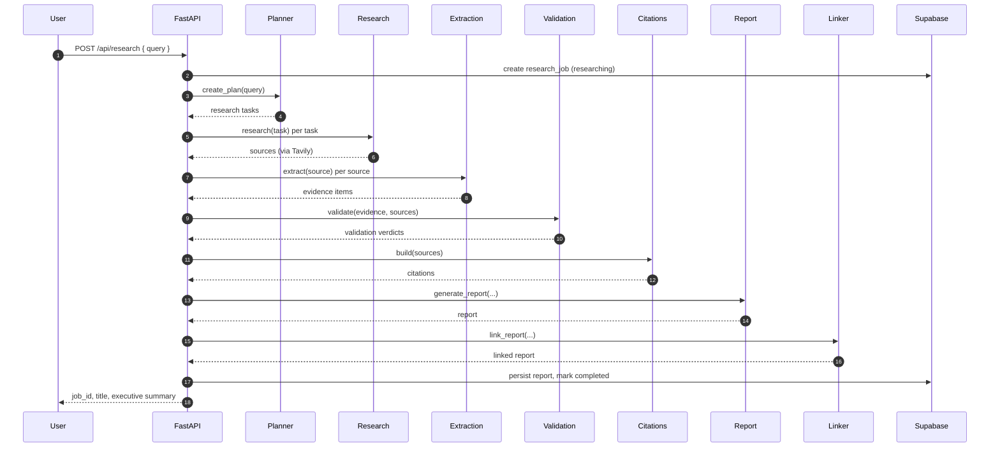
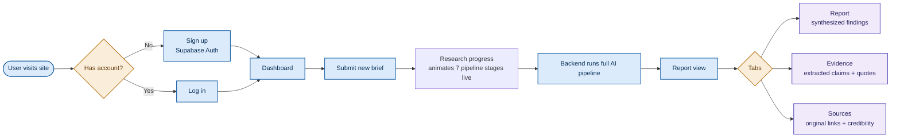

<div align="center">

<p align="center">
  
</p>

# Meridian - AI Market Research & Strategy Engine

### An autonomous multi-agent system that turns a research brief into a fully cited, consulting-grade market report

<br/>


<br/><br/>


</div>

<br/>

> A signed-in user submits a research brief. Seven specialized AI agents plan, search the live web, extract evidence, validate it, and write a polished report. Every finding traceable back to its original source.

<br/>

## Table of Contents

- [What This Project Is](#what-this-project-is)
- [Business Problem](#business-problem)
- [Product Goal](#product-goal)
- [Highlights](#highlights)
- [System Architecture](#system-architecture)
- [The Multi-Agent Research Pipeline](#the-multi-agent-research-pipeline)
- [Backend — FastAPI Service](#backend--fastapi-service)
- [Frontend — React + Vite Dashboard](#frontend--react--vite-dashboard)
- [End-to-End User Flow](#end-to-end-user-flow)
- [Tech Stack](#tech-stack)
- [Getting the Project Running Locally](#getting-the-project-running-locally)
- [Live Demo](#live-demo)
- [Security Notes](#security-notes)
- [Evaluation & Reliability](#evaluation--reliability)
- [Known Limitations](#known-limitations)
- [Performance Metrics](#performance-metrics)
- [Future Improvements](#future-improvements)
- [Team Contributions](#team-contributions)
- [Screenshots](#screenshots)
- [Project Status](#project-status)

<br/>

## What This Project Is

This project is an AI-powered market research analyst. A signed-in user submits a research brief, for example *"Analyze the competitive landscape of the EV battery market in Southeast Asia"*, and behind the scenes a pipeline of seven specialized AI agents works in sequence to:

| Step | What happens |
|:---:|---|
| 1 | Break the brief into a structured, searchable research plan |
| 2 | Search the live web for relevant, credible sources |
| 3 | Extract concrete, quotable evidence from each source |
| 4 | Cross-check that evidence for reliability |
| 5 | Turn validated evidence into a polished, structured report |
| 6 | Attach every claim in the report back to its original citation |

The result is served through a McKinsey-styled web dashboard, where the user watches the pipeline run in real time and then reads the final report through a **Report / Evidence / Sources** tabbed view. Every key finding traceable back to a live web source.

<br/>

## Business Problem

Market and competitive research is normally slow and manual: an analyst spends hours searching the web, reading sources, extracting claims, and cross-checking them before a single report can be written and that report is only as trustworthy as the diligence behind it. LLMs can write the report in seconds, but a report with no traceable sourcing isn't something a business can act on.

Meridian exists to close that gap. The goal isn't just a faster report, but one where every claim is traceable back to a source, the way an analyst's would be.

<br/>

## Product Goal

Meridian's goal is to make an AI-generated market report something a decision-maker can actually rely on. Concretely, that means:

- **Automate the research grunt work** — planning, searching, extracting, and cross-checking evidence without automating away the trust that comes from citations.
- **Keep every finding traceable** — a user can click from any key finding in the report down to the exact evidence and source that backs it.
- **Make the wait transparent** — instead of a spinner, the user watches which of the seven pipeline stages is currently running.
- **Ship it as a real product**, not a notebook demo — real authentication, per-user data isolation, and a deployed frontend and backend.

<br/>

## Highlights

<table>
<tr>
<td width="33%" valign="top">

**Multi-agent pipeline**

Seven purpose-built agents → Planner, Research, Extraction, Validation, Citation, Report, Linker. Each with one job, chained into a single fail-fast pipeline.

</td>
<td width="33%" valign="top">

**Real authentication**

Full Supabase Auth with server-verified JWTs, not a demo gate. Every research job is scoped to its owner and enforced at the API layer.

</td>
<td width="33%" valign="top">

**Full traceability**

Every key finding in the final report links back to the exact evidence and web source that supports it. Nothing is asserted without a citation trail.

</td>
</tr>
</table>

<br/>


## System Architecture

The project is split into two independently deployed halves that communicate over a REST API secured with Supabase Auth.



| Layer | Responsibility |
|---|---|
| **Frontend** | React 19 SPA (Vite) — authentication, brief submission, an animated progress screen, and a tabbed report viewer. |
| **Backend** | FastAPI service — enforces authentication, orchestrates the AI pipeline per request, and persists every intermediate artifact so any stage of a job can be queried later. |
| **Database** | Supabase (managed Postgres) — structured relational storage, plus a `pgvector`-backed `memory_records` table for future semantic recall. |

<br/>

## The Multi-Agent Research Pipeline

The heart of the project is `ai/pipeline/research_pipeline.py`, which orchestrates seven sequential stages. Each stage has a single, focused responsibility and hands a typed data structure to the next.



| Stage | Module | Responsibility |
|---|---|---|
| **1. Planning** | `ai/planner/planner_agent.py` | Decomposes the raw research brief into a list of discrete, searchable `ResearchTask`s. |
| **2. Research** | `ai/research/research_agent.py` | Executes a live web search per task (via Tavily) and returns candidate `Source`s. |
| **3. Extraction** | `ai/extraction/extraction_agent.py` | Reads each source and pulls out concrete, quotable `Evidence` (claim + supporting quote). |
| **4. Validation** | `ai/validation/validation_agent.py` | Cross-checks each piece of evidence against its source and assigns a confidence verdict. |
| **5. Citation Building** | `ai/report/citation_builder.py` | Converts raw sources into properly formatted citation objects. |
| **6. Report Generation** | `ai/report/report_agent.py` | Synthesizes validated evidence into a structured `Report` (title, executive summary, key findings). |
| **7. Report Linking** | `ai/report/report_linker.py` | Rewrites the report so every key finding links to its supporting evidence and citation. Powers the Evidence / Sources tabs. |

> **Fail-fast, with retries.** Each stage retries automatically on transient failures (e.g. a flaky search call or LLM timeout) before giving up. If a stage still returns an empty result after retrying (no tasks, no sources, no evidence...), the pipeline raises immediately instead of silently producing a hollow report, and the job is marked `failed`.

**LLM & search providers**
- **Gemini** (`google-genai`) — the reasoning engine behind the Planner, Extraction, Validation, and Report agents (`ai/llm/gemini.py`).
- **Tavily** — the live web search provider used by the Research agent (`ai/browser/tavily_search.py`), with a `mock_search.py` fallback for offline development.

<br/>

## Backend — FastAPI Service

**Location:** `Backend McKinsey/mckinsey-research-engine/`

<details>
<summary><b>Backend folder structure</b></summary>

```
backend/
├── main.py                  # FastAPI app factory, middleware, routers
├── core/
│   ├── config.py             # Pydantic settings loaded from .env
│   ├── auth.py                # Supabase JWT verification dependency
│   ├── errors.py              # Centralized AppError → HTTP response mapping
│   └── logging.py             # Structured logging configuration
├── middleware/
│   └── request_id.py          # Attaches a unique request ID to every request
├── api/
│   ├── research.py             # Create + inspect research jobs (the core workflow)
│   ├── reports.py              # Fetch generated reports
│   └── evidence.py              # Fetch raw evidence records
├── repositories/                # One repository per table — all Supabase reads/writes
├── services/
│   └── research_service.py       # Bridges the API layer to the AI pipeline
└── db/
    ├── supabase_client.py         # Supabase client singleton
    └── migrations/                  # Ordered SQL migrations (001 → 009)
```

</details>

### Authentication & Authorization

Every protected route depends on `get_current_user` (`backend/core/auth.py`):

1. The frontend sends the Supabase session's access token as a `Bearer` token in the `Authorization` header.
2. The backend calls `supabase.auth.get_user(token)` to verify the token server-side against Supabase.
3. If valid, the authenticated `user` object is injected into the route; if not, a `401` is raised.
4. On job-scoped routes (`/api/research/{job_id}/...`), an additional `_ensure_owner` check confirms the requesting user actually created that job, returning `403` otherwise.

> No research job or report is ever visible to a user who didn't create it, even if they know the job's UUID.

### API Surface

| Method | Route | Purpose |
|:---:|---|---|
| `GET` | `/` | Service metadata / liveness |
| `GET` | `/health` | Health check for uptime monitors / deploy platforms |
| `GET` | `/api/research/` | List all research jobs owned by the current user |
| `POST` | `/api/research/` | Submit a new brief → runs the full pipeline synchronously → returns the completed job |
| `GET` | `/api/research/{job_id}` | Fetch job status/metadata |
| `GET` | `/api/research/{job_id}/tasks` | Planner-generated research tasks |
| `GET` | `/api/research/{job_id}/sources` | Sources discovered during research |
| `GET` | `/api/research/{job_id}/evidence` | Extracted evidence items |
| `GET` | `/api/research/{job_id}/validations` | Validation verdicts per evidence item |
| `GET` | `/api/research/{job_id}/report` | The final generated report |

### Database Schema (Supabase / Postgres)

Nine ordered migrations build the schema incrementally:

| # | Migration | Table(s) created |
|:---:|---|---|
| 001 | Initial schema / Research Jobs | `research_jobs` |
| 002 | Planner Tasks | `planner_tasks` |
| 003 | Sources | `sources` |
| 004 | Evidence | `evidence` |
| 005 | Validation Records | `validation_records` |
| 006 | Memory | `memory_records` — `pgvector` column for future semantic search |
| 007 | Reports | `reports` |
| 008 | Indexes | Indexes on `evidence.job_id`, `planner_tasks.job_id`, and an `ivfflat` vector index on `memory_records.embedding` |

`research_jobs.created_by` reference `auth.users(id)`, tying every record directly to a Supabase Auth identity. This is what makes per-user data isolation possible.

### Backend Environment Variables

```env
# Search / AI provider keys used by the research pipeline
GOOGLE_API_KEY=          # Gemini API key
TAVILY_API_KEY=          # Tavily web search API key

# Supabase project (Project Settings > API in the Supabase dashboard)
SUPABASE_URL=https://your-project-ref.supabase.co
SUPABASE_KEY=            # SERVICE ROLE key — backend only, never expose to the frontend
```

<br/>

## Frontend — React + Vite Dashboard

**Location:** `Frontend McKinsey/vite-project/`

<details>
<summary><b>Frontend folder structure</b></summary>

```
src/
├── App.jsx                     # Route definitions
├── main.jsx                     # React entry point
├── context/
│   ├── AuthContext.jsx           # Supabase session state, login/signup/logout
│   └── ThemeContext.jsx           # Light/dark theme toggle
├── components/
│   ├── ProtectedRoute.jsx          # Redirects unauthenticated users to /login
│   ├── AuthLayout.jsx               # Shared shell for Login/Signup
│   ├── Shell.jsx                     # Main app shell (nav, layout) for authenticated pages
│   ├── StatusBadge.jsx                # Visual pipeline-status indicator
│   └── Footer.jsx
├── pages/
│   ├── Login.jsx / Signup.jsx           # Supabase Auth screens
│   ├── Dashboard.jsx                      # List of past research jobs + "new research" entry point
│   ├── ResearchProgress.jsx                 # Animated live view of the 7-stage pipeline running
│   ├── ReportView.jsx                        # Tabbed final output: Report / Evidence / Sources
│   ├── Methodology.jsx                        # Explains how the AI pipeline works, for end users
│   └── AboutProject.jsx                        # Project background page
├── api/
│   └── client.js                # Central fetch wrapper — attaches the Supabase bearer token to every request
└── lib/
    └── supabaseClient.js         # Supabase JS client singleton (anon key)
```

</details>

### Routing Map

| Route | Page | Access |
|---|---|:---:|
| `/login` | `Login` | Public |
| `/signup` | `Signup` | Public |
| `/` | `Dashboard` | Protected |
| `/research/new` | `ResearchProgress` | Protected |
| `/research/:jobId` | `ReportView` | Protected |
| `/methodology` | `Methodology` | Protected |
| `/about` | `AboutProject` | Protected |
| `*` | → redirects to `/` | — |

`ProtectedRoute` wraps every authenticated page and reads session state from `AuthContext`; unauthenticated visitors are always redirected to `/login`.

### Design System

The UI follows a navy-and-gold "Meridian" consulting brand intended to evoke a McKinsey-style strategy deliverable: dark navy chrome, gold accent highlights, and clean, data-forward typography.

| Concern | Library |
|---|---|
| Styling | Tailwind CSS v4 |
| Animation | Framer Motion - used heavily on the live `ResearchProgress` screen |
| Icons | Lucide React, React Icons, FontAwesome |

### Frontend Environment Variables

```env
# Supabase project settings (Project Settings > API in the Supabase dashboard)
VITE_SUPABASE_URL=https://your-project-ref.supabase.co
VITE_SUPABASE_ANON_KEY=paste-your-anon-public-key-here   # public/anon key only

# Base URL of the FastAPI backend
VITE_API_BASE_URL=http://localhost:8000
```

> The frontend must only ever use the Supabase anon/public key. The service role key belongs exclusively in the backend `.env` and must never ship to the browser.

<br/>

## End-to-End User Flow



1. A new user signs up or an existing user logs in through Supabase Auth on the frontend.
2. Once authenticated, the user lands on the Dashboard, listing any research jobs they've previously run.
3. Submitting a new brief navigates to `/research/new`, where the Research Progress screen calls `POST /api/research/` and animates the pipeline while the backend works.
4. The backend runs the entire seven-stage pipeline synchronously, persisting every intermediate artifact to Supabase, and returns the completed job.
5. The user lands on `/research/:jobId` — the Report View — and moves between Report, Evidence, and Sources tabs, from the final narrative down to the original web source behind any individual claim.

<br/>

## Tech Stack

<div align="center">

| Layer | Technology |
|---|---|
| Frontend framework | React 19 + Vite |
| Frontend styling | Tailwind CSS v4, Framer Motion |
| Frontend auth | Supabase JS client (`@supabase/supabase-js`) |
| Routing | React Router v7 |
| Backend framework | FastAPI (Python) |
| Backend server | Uvicorn |
| Config management | Pydantic Settings |
| Database | Supabase (Postgres) + `pgvector` |
| Backend auth | Supabase Auth (server-side JWT verification) |
| LLM provider | Google Gemini (`google-genai`) |
| Web search provider | Tavily |
| Deployment (frontend) | Vercel (`vercel.json` present) |

</div>

<br/>

## Getting the Project Running Locally

These are the exact steps to take this codebase from a fresh clone to a fully working local instance.

### Step 1 — Prerequisites
Install Git, Node.js (v18+), and Python (3.11+).

### Step 2 — Set Up Supabase
1. Create a new project at [supabase.com](https://supabase.com).
2. In the SQL editor, run each file in `backend/db/migrations/` in numeric order (`001` → `009`) to build the full schema, including the `pgvector` extension and indexes.
3. From Project Settings → API, copy:
   - The Project URL
   - The anon/public key (for the frontend)
   - The service_role key (for the backend only)

### Step 3 — Backend Setup
```bash
cd "Backend McKinsey/mckinsey-research-engine"
python -m venv venv
source venv/bin/activate        # Windows: venv\Scripts\activate
pip install -r backend/requirements.txt

cp .env.example .env
# then fill in: GOOGLE_API_KEY, TAVILY_API_KEY, SUPABASE_URL, SUPABASE_KEY (service role)

uvicorn backend.main:app --reload --port 8000
```
The API will be live at `http://localhost:8000`, with interactive docs at `http://localhost:8000/docs`.

### Step 4 — Frontend Setup
```bash
cd "Frontend McKinsey/vite-project"
npm install

cp .env.example .env
# then fill in: VITE_SUPABASE_URL, VITE_SUPABASE_ANON_KEY, VITE_API_BASE_URL=http://localhost:8000

npm run dev
```
The app will be live at `http://localhost:5173`.

### Step 5 — Verify
1. Open the frontend, sign up for a new account.
2. Submit a test research brief and confirm the progress screen animates through the pipeline stages.
3. Confirm the completed job produces a report with populated Report, Evidence, and Sources tabs.

### Step 6 — Deploy to Production
- **Frontend** — deploy via Vercel using the included `vercel.json`; set the three `VITE_*` environment variables, pointing `VITE_API_BASE_URL` at the deployed backend URL.
- **Backend** — deploy the FastAPI app to your platform of choice (Render, Railway, Fly.io); set `SUPABASE_URL`, `SUPABASE_KEY` (service role), `GOOGLE_API_KEY`, `TAVILY_API_KEY`, and `CORS_ORIGINS` (comma-separated list including the deployed frontend domain).

<br/>

## Live Demo

<div align="center">


**App:** [meridian-frontend-fawn.vercel.app](https://meridian-frontend-fawn.vercel.app)
**Source:** [github.com/aryanroy666/Meridian-AI-Market-Research-Strategy-Engine](https://github.com/aryanroy666/Meridian-AI-Market-Research-Strategy-Engine)

</div>

> Sign up with your email to try it. A live run submits a real brief through the full seven-stage pipeline, so expect it to take a minute or two rather than return instantly.

<br/>

## Security Notes

| Safeguard | Description |
|---|---|
| **Two-tier Supabase keys** | The anon/public key (safe for the browser) is used by the frontend for auth only; the service-role key (full database access) is confined to the backend and never exposed client-side. |
| **Server-verified sessions** | The backend never trusts client-supplied identity. Every bearer token is independently verified against Supabase on every call. |
| **Per-user data isolation** | Job ownership is enforced at the API layer (`_ensure_owner`), so users can only ever read their own jobs, tasks, sources, evidence, validations, and reports. |
| **Restricted CORS** | `CORS_ORIGINS` explicitly allowlists origins rather than leaving the API open, so only approved frontend domains may call it. |

<br/>

## Evaluation & Reliability

Reliability is built into the pipeline itself rather than checked afterward:

| Mechanism | How it works |
|---|---|
| **Dedicated validation stage** | Before anything reaches the report, the Validation agent (`ai/validation/validation_agent.py`) cross-checks every extracted piece of evidence against its source and assigns it a confidence verdict. The evidence isn't trusted just because it was extracted. |
| **Citation-backed findings** | The Report Linker (`ai/report/report_linker.py`) rewrites the report so every key finding links back to the exact evidence and source behind it. This is what powers the Report / Evidence / Sources tabs, and it means a finding with no traceable source can't silently make it into the final report. |
| **Fail-fast on weak results** | If a stage comes back empty even after its retries (no tasks, no sources, no evidence), the pipeline stops and marks the job `failed` instead of letting a thin or unsupported report through. |
| **Server-verified auth on every request** | Every bearer token is independently re-verified against Supabase on each call, so job ownership and access checks can't be spoofed client-side. |

> Today this reliability is structural, enforced by the pipeline's own stages, rather than measured by a separate offline eval suite. Adding automated report-level scoring (citation coverage, hallucination spot-checks) is tracked under [Future Improvements](#future-improvements).

<br/>

## Known Limitations

| Limitation | Detail |
|---|---|
| **Synchronous pipeline** | `POST /api/research/` runs all seven stages inline and only responds once the job is complete. There's no streaming or webhook callback, so the frontend's live progress view is a client-side animation timed to the expected stages rather than a true server-pushed status feed. |
| **Single LLM provider** | The Planner, Extraction, Validation, and Report agents all depend on Gemini with no fallback provider. A Gemini outage stalls every new research job. |
| **Semantic recall unused** | The `pgvector`-backed `memory_records` table exists in the schema but isn't yet read from or written to by the pipeline. There's no cross-job memory or recall today. |

<br/>

## Performance Metrics

End-to-end run time depends on the seven-stage pipeline's calls to Gemini and Tavily, so it varies with upstream API load rather than being fixed:

| Scenario | Runtime |
|---|:---:|
| Best Case | 45secs – 55secs |
| Typical Case | 1min – 1min 30secs |
| Worst Case (heavy Gemini traffic) | 1min 30secs – 2min 30secs |

<br/>

## Future Improvements

| Idea | Why it'd help |
|---|---|
| **Streamed pipeline status** | Replace the client-timed progress animation with real server-pushed stage updates (WebSocket or SSE), so the UI reflects what the backend is actually doing at that moment. |
| **Multi-provider LLM fallback** | Fall back to a second LLM provider if Gemini is unavailable or rate-limited, instead of stalling new jobs. |
| **Activate semantic memory** | Start writing to `memory_records` so related past research (e.g. a previously researched market) can inform a new brief instead of starting from zero each time. |
| **Exportable reports** | Let a user download a completed report as PDF or share a read-only link, rather than only viewing it in-app. |
| **Automated report evaluation** | A lightweight eval pass (e.g. citation-coverage checks, hallucination spot-checks) run against every generated report before it's marked complete. |

<br/>

## Team Contributions

<div align="center">

| Member | Role |
|---|---|
| **Aryan Roy** (GR) | Frontend & UX/UI |
| **Deepak Chauhan** | Auth & API communication |
| **Vikram Kumar R.** | Backend & API Layer |
| **Prajwal Girade** | AI agents 1-3 (Planning Agent, Research Agent, Extraction Agent) |
| **Priyanshu Singh** | AI agents 4-5 (Validation Agent, Citation Agent) |
| **Aditya Tyagi** | AI agents 6-7 (Report Agent, Linker Agent) |
| **Shashank Meshram** | Database & Persistence |

All contributors were involved across development, testing, documentation, and refinement throughout the project.

</div>

<br/>

## Screenshots

### Dashboard & Dark Mode
A consulting-grade workspace with a navy-and-gold dark theme built for long research sessions.


### Research Progress
Seven specialized AI agents plan, search, extract, validate, cite, and report in real time.


### Report View
Every finding is backed by evidence, every claim is cited, and every source carries a transparent confidence score.


<br/>

## Project Status

<div align="center">

**This repository represents the final, deployed state of the Meridian AI Market Research & Strategy Engine**, a working, end-to-end multi-agent research application spanning authentication, a seven-stage AI pipeline, full evidence traceability, and a polished consulting-styled UI.

<br/>


</div>
