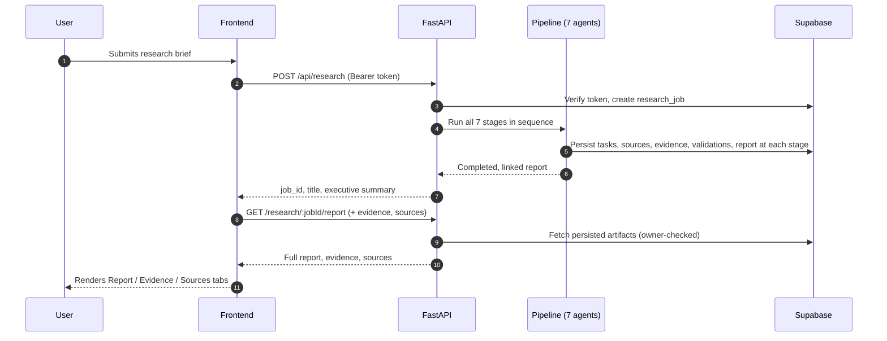

# Architecture

### How Meridian is put together

 

> This file goes deeper on *why* the system is shaped this way than the [System Architecture](../README.md#system-architecture) section in the main README. Read that first for the high-level diagram. This is the reasoning behind it.

 

## Table of Contents

- [Design Principles](#design-principles)
- [The Three Layers](#the-three-layers)
- [Why a Synchronous Pipeline](#why-a-synchronous-pipeline)
- [Data Flow, End to End](#data-flow-end-to-end)
- [Why Seven Separate Agents](#why-seven-separate-agents)
- [Trust Model](#trust-model)
- [Where State Lives](#where-state-lives)

 

## Design Principles

Three things stand out as you read through the codebase:

1. **Traceability over speed.** The pipeline could hand the LLM a query and return a report in one shot. Instead it's broken into stages: research, extraction, validation, citation - and the effect is that every claim in the final report can be traced back to a real source. That traceability lines up with the [Product Goal](../README.md#product-goal), even at the cost of a slower response than a single-shot approach would give.
2. **Fail loud, not quiet.** A pipeline stage that comes back empty doesn't get papered over. It fails the job outright, per the fail-fast behavior described in [Evaluation & Reliability](EVALUATION.md#mechanism-3--fail-fast-on-weak-results).
3. **Two independently deployable halves.** Frontend and backend don't share a runtime, a language, or a deploy target. The only contract between them is the REST API, see [API.md](API.md).

 

## The Three Layers

| Layer | Responsibility | Lives in |
|---|---|---|
| **Frontend** | Auth UI, brief submission, the animated progress screen, and the tabbed report viewer. Talks to the backend exclusively over HTTPS + bearer token. It never touches Supabase's database directly, only Supabase Auth. | `Frontend McKinsey/vite-project/` |
| **Backend** | Owns every business rule: authentication, ownership checks, running the pipeline, and persisting every intermediate artifact so a job can be inspected stage-by-stage after the fact. | `Backend McKinsey/mckinsey-research-engine/` |
| **Database** | Supabase (managed Postgres) for structured relational storage, plus a `pgvector` column reserved for future semantic recall. The backend is the only thing that talks to it with elevated privileges, see [Trust Model](#trust-model) below. | Supabase project |

The frontend is intentionally kept "dumb" relative to the backend: it renders state and submits requests, but every decision about what a user is allowed to see or do is enforced server-side. A user could open dev tools and rewrite frontend code all they want. The API would still refuse anything outside their own jobs.

 

## Why a Synchronous Pipeline

`POST /api/research/` blocks until all seven stages finish and returns the completed job in one response. Structuring it this way has a couple of upsides:

- **Simplicity.** No job queue, no websocket infrastructure, no polling logic on either side. One request, one response.
- **Consistency.** The frontend never has to reconcile a partially-complete job state; a `200` means the report genuinely exists and is fully linked.

The trade-off is real, though: because there's no server-pushed status feed, the frontend's live progress screen is a *client-side animation* timed to roughly match the pipeline's expected stages. It isn't literally reflecting what the backend is doing at that exact second. That gap is called out explicitly in [Known Limitations](../README.md#known-limitations), and moving to a streamed status feed is listed under [Future Improvements](../README.md#future-improvements).

 

## Data Flow, End to End

Note that every intermediate artifact, not just the final report, is persisted as it's produced. That's what lets a completed job be queried stage-by-stage later (via the [job-scoped sub-resources](API.md#job-scoped-sub-resources)) instead of only exposing the final output.

 

## Why Seven Separate Agents

The pipeline could plausibly be fewer, larger stages. Splitting it into seven narrow ones has a couple of effects worth noting:

- **Single responsibility, testable in isolation.** Each agent takes a typed input and produces a typed output; the Validation agent's confidence scoring can be reasoned about without needing a live web search.
- **A clean seam for the fail-fast rule.** Because each stage's output is checked before being handed to the next, a weak result (e.g. zero credible sources found) is caught at the exact stage that produced it, rather than surfacing as a vague failure somewhere downstream.

The trade-off is more sequential LLM/network calls than a single-shot approach, which is the direct cause of the run times in [Performance Metrics](../README.md#performance-metrics).

 

## Trust Model

| Boundary | Enforced by |
|---|---|
| Anonymous vs. authenticated | Supabase Auth session, verified server-side on every request. Never trusted from the client alone |
| User A vs. User B's data | `_ensure_owner` check on every job-scoped route, backed by `research_jobs.created_by` referencing `auth.users(id)` |
| Frontend vs. database | Frontend holds only the Supabase **anon** key (auth only); the **service role** key with full database access lives exclusively in the backend's environment |
| Approved origins vs. everyone else | `CORS_ORIGINS` allowlist on the FastAPI app |

The database itself is never assumed to be a safe boundary on its own. Access control is enforced at the API layer on every read, not just relied on via row-level policy.

 

## Where State Lives

| State | Lives in |
|---|---|
| User identity, session | Supabase Auth |
| Research jobs, tasks, sources, evidence, validations, reports | Supabase Postgres (nine ordered migrations, see the main README's [Database Schema](../README.md#database-schema-supabase--postgres)) |
| In-flight pipeline progress | Nowhere persisted. It exists only for the duration of the synchronous request, in backend process memory |
| Theme (light/dark), auth session on the client | React context (`ThemeContext`, `AuthContext`). No server round-trip needed for either |
