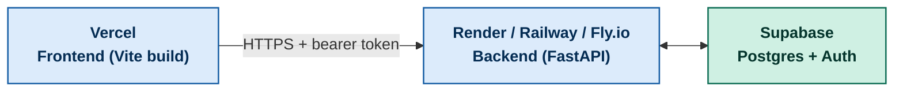

<div align="center">

# Deployment Guide

### Getting Meridian running in production


</div>

<br/>

> For getting the project running **locally**, see [Getting the Project Running Locally](../README.md#getting-the-project-running-locally) in the main README. This file only covers taking it to production.

<br/>

## Table of Contents

- [Overview](#overview)
- [1. Provision Supabase](#1-provision-supabase)
- [2. Deploy the Backend](#2-deploy-the-backend)
- [3. Deploy the Frontend](#3-deploy-the-frontend)
- [4. Wire CORS Between Them](#4-wire-cors-between-them)
- [5. Verify the Deployment](#5-verify-the-deployment)
- [Redeploying After Changes](#redeploying-after-changes)
- [Current Live Deployment](#current-live-deployment)

<br/>

## Overview

Meridian's two halves deploy independently and only need to agree on two things: the backend's public URL (so the frontend knows where to send requests) and the frontend's public URL (so the backend's CORS allowlist accepts it). There's no shared build step and no monorepo deploy pipeline.



<br/>

## 1. Provision Supabase

Do this once, before deploying either half:

1. Create a project at [supabase.com](https://supabase.com).
2. In the SQL editor, run every file in `backend/db/migrations/` in numeric order (`001` → `009`). This builds the full schema, including the `pgvector` extension and its indexes.
3. From **Project Settings → API**, copy:
   - The **Project URL**
   - The **anon/public key** : this goes to the frontend only
   - The **service_role key** : this goes to the backend only, and must never reach the browser

<br/>

## 2. Deploy the Backend

The backend is a standard FastAPI app (`backend/main.py`), deployable to any platform that runs a long-lived Python process: Render, Railway, and Fly.io are all straightforward fits.

**Environment variables to set on the platform:**

```env
GOOGLE_API_KEY=          # Gemini API key
TAVILY_API_KEY=          # Tavily web search API key
SUPABASE_URL=https://your-project-ref.supabase.co
SUPABASE_KEY=            # SERVICE ROLE key (backend only)
CORS_ORIGINS=            # comma-separated list; added in step 4 below
```

**Start command** (adjust the port to whatever your platform expects):

```bash
uvicorn backend.main:app --host 0.0.0.0 --port $PORT
```

Once live, confirm `https://<your-backend-url>/health` returns a healthy response before moving on. This is the same endpoint uptime monitors should point at long-term.

<br/>

## 3. Deploy the Frontend

The repo already includes a `vercel.json`, so Vercel is the path of least resistance. Though any static host that can run a Vite build works.

**On Vercel:**

1. Import the repo, pointing the project root at `Frontend McKinsey/vite-project/`.
2. Set these environment variables in the Vercel project settings:

```env
VITE_SUPABASE_URL=https://your-project-ref.supabase.co
VITE_SUPABASE_ANON_KEY=your-anon-public-key   # anon key only. never the service role key.
VITE_API_BASE_URL=https://your-backend-url
```

3. Deploy. Vercel will run the Vite build and serve the resulting static bundle.

<br/>

## 4. Wire CORS Between Them

The backend rejects cross-origin requests from any domain not explicitly listed. Once the frontend has a live URL, go back to the backend's environment variables and set:

```env
CORS_ORIGINS=https://your-frontend-url.vercel.app
```

Redeploy the backend after changing this as most platforms require a restart to pick up new environment variables.

<br/>

## 5. Verify the Deployment

Same checklist as local verification, run against the live URLs:

1. Open the deployed frontend and sign up for a new account.
2. Submit a test research brief and confirm the progress screen runs to completion.
3. Confirm the completed job produces a report with populated Report, Evidence, and Sources tabs.
4. Check the backend logs for the request. Confirm the bearer token was verified and no CORS errors were thrown.

<br/>

## Redeploying After Changes

| Change | What to do |
|---|---|
| Frontend code only | Push to the connected branch. Vercel redeploys automatically. |
| Backend code only | Push to the connected branch/repo on your backend platform, or trigger a manual deploy. |
| New environment variable | Update it on the platform's dashboard, then redeploy that service. env var changes are not picked up by a running process. |
| New database migration | Run the new `backend/db/migrations/` file manually against Supabase's SQL editor; migrations are not applied automatically on deploy. |

<br/>

## Current Live Deployment

<div align="center">


**App:** [meridian-frontend-fawn.vercel.app](https://meridian-frontend-fawn.vercel.app)

</div>

> If you've since redeployed under a different Vercel URL, update this section and the [Live Demo](../README.md#live-demo) section in the main README together so they don't drift apart.

